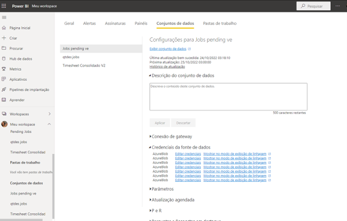
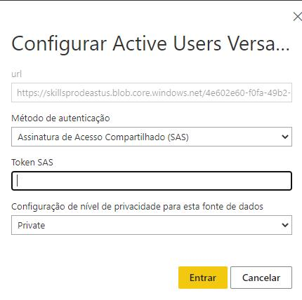
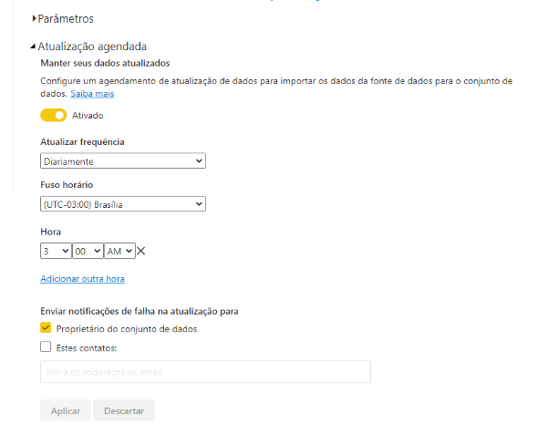
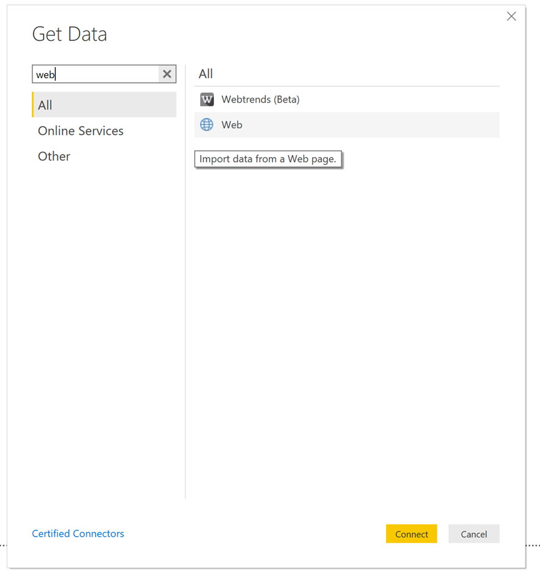
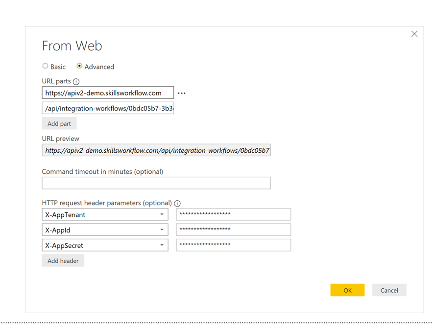
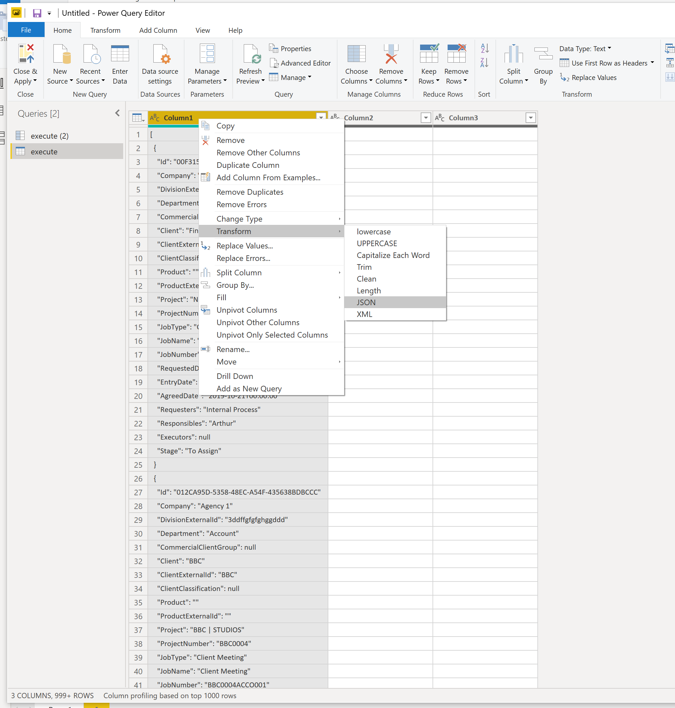
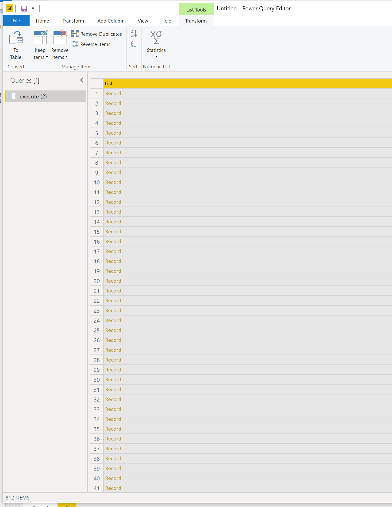
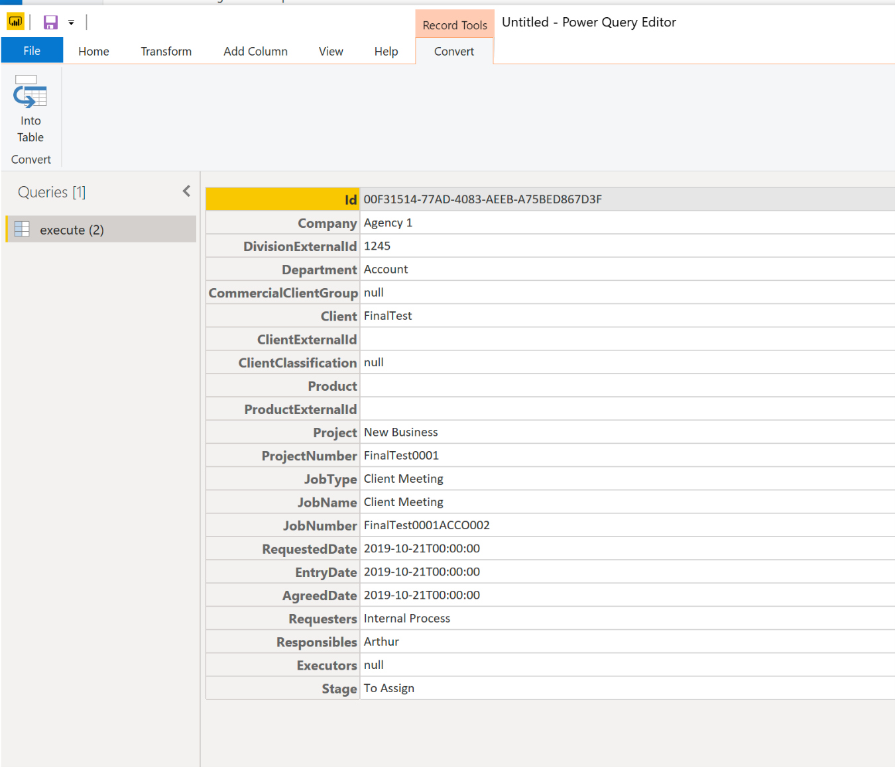
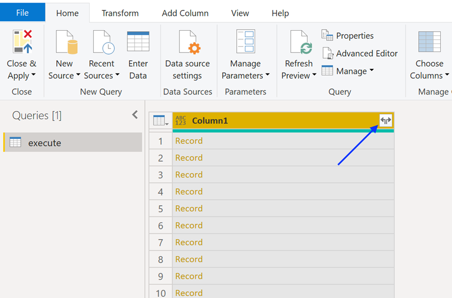
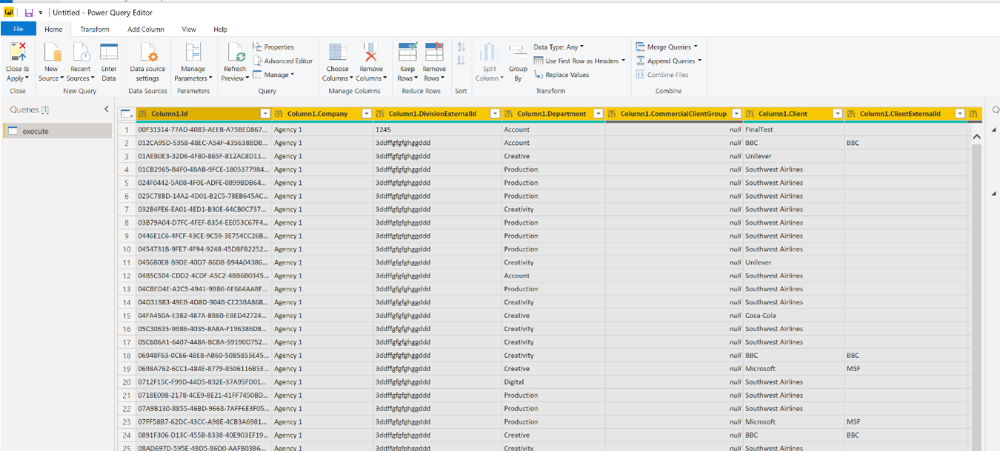

### Description
Produces a Power BI Workspace using data aquired from SkillsWorkflow.<br />
Data is extracted from a Query installed in the Tenant. The Analytics service runs de Query and sends it to a CSV file. The CSV File is then added as a Data Source in the Power BI Workspace.

---

### Configuration

#### Skills Workflow
 - Go into the tenant in Maintenance and create Query.
   - Name the Query with the prefix "Power BI - " (e.g., Power BI - Active Jobs)
   - Set the Categoty to "Power BI"
 - Create a new Schedule to run the Query using the Configuration.
   - Set the running times of the File generation based on the Query that is run
   - Set the name of the File to generate. No spaces are allowed (e.g., PowerBI-ActiveJobs)
 - The Schedule will generate an URL for the File that is generated.
 - Running
   - The Query can be forced to be run manually.
   - Go into the Configuration and run the specified Schedule.
   - This will execute the Query and generate the File.


#### Workspaces
The Workspaces in Power BI will have Data Sources pointing to the URL of the Files. <br/>The URL of the Files is shown in the Schedules that are created in Configuration.<br/>The data refresh (i.e., when Power BI reads the data from the Files) can be set to a minimum of every 30 minutes.
##### Setup
  - In Power BI, create a Workspace.
  - Go into the Data Source section and add a new Web data source.
  - Get the URL for the generated file from the Schedule generation and paste it here.
  - The data will be available in the Report pages for use.

#### Schedule updates on Power BI
After publishing your Power BI dashboard you need to schedule the updates in the Office365 environment.
You have to ask Skills Workflow team to send the credentials for each datasource.
Once you get it, in the Power BI portal go to desired Dataset and click on dataset credentials.

<figure>


<figcaption>Update Every Data Source</figcaption>
</figure>
<figure>


<figcaption>Change the Privacy configuration to Private, Authentication mode SAS and add the token provided.</figcaption>
</figure>

After changing all datasets setup, go to Scheduled Update:
- Choose Activate and set the time that you want to run the update
- Click Apply

<figure>


<figcaption>Defining the schedule.</figcaption>
</figure>

---
### Power Bi Integration with API

#### Overview
There was a need to export job data from the system to Power Bi
#### Data Exchange
The scope of this article includes an explanation of how to get data from the system.<br/>
Skills Workflow has available specific APIs to extract information prepared to be used in Power BI dashboards, so you can use it to get the data out from the system. You can get the data using REST calls.<br/>
Regarding Power BI, you should request to the team the corresponding URL to export data, ie:
- [https://apiv2-demo.skillsworkflow.com/api/integration-workflows/0bdc05b7-3b3d-41f3-9e84-b6f75d3a6307/execute](https://apiv2-demo.skillsworkflow.com/api/integration-workflows/0bdc05b7-3b3d-41f3-9e84-b6f75d3a6307/execute)

#### Configuration
There are 2 ways to use Skills APIs in PowerBI, both you need to ask Skills’ team the credentials to access the data.<br/>
Skills Team will send you the information bellow:
- URL parts
- HTTP request headers parameters
- X-AppTenant
- X-AppId
- X-AppSecret

If you’re using REST API Endpoint (GET):
<figure>


<figcaption>Aquire from web Endpoint</figcaption>
</figure>
<figure>


<figcaption>Advanced Form</figcaption>
</figure>

The APIv2 Apis are normally created with a POST.
In this scenario open a blank query and add the commands bellow to get the data:
``` javascript
let
body = "{}",
Data= Web.Contents("URL Provided", [Content=Text.ToBinary(body)
in
#"Data"
```
Once you have the data extracted you have to transform it to create your dashboard. 

#### Transform Your Data
To be able to manage your data in Power Bi, you will need to follow some steps:
- Transform column into json:

<figure>


<figcaption>Transform column into json</figcaption>
</figure>

- Transform list into json

<figure>


<figcaption>Transform list into json</figcaption>
</figure>

- Convert data into table

<figure>


<figcaption>Convert data into table</figcaption>
</figure>

- Set configuration to open as Json
- Split data into columns

<figure>


<figcaption>Split data into columns</figcaption>
</figure>

- The data will be in columns

<figure>


<figcaption>The data will be in columns</figcaption>
</figure>