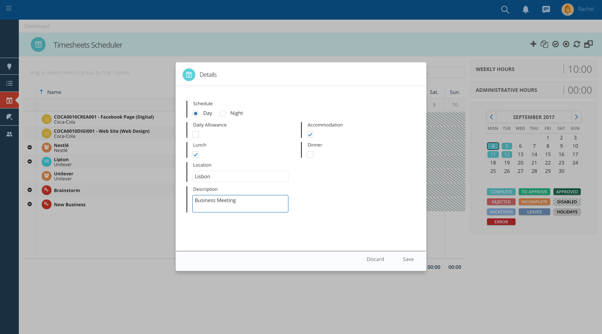

## Llenar hojas de tiempo

:::note 
Para completar las horas, navegue hasta el módulo **Time sheets**

:::

1. Para completar las horas, navegue hasta el módulo "Timesheets"

<figure>

<figcaption>Módulo de Folha de Horas</figcaption>
</figure>

2. Verifique si algunas líneas aparecen en su cuadrícula automáticamente, según los trabajos que se le han asignado.

3. Si no está viendo el trabajo o el proyecto que necesita, haga clic en "+" para agregar una nueva entrada a la cuadrícula del parte de horas. Se abrirá una ventana emergente.

4. Luego use el campo de búsqueda en la parte superior para buscar rápidamente el número de trabajo, el nombre del cliente o cualquier otra palabra clave.

5. En esta ventana emergente puede encontrar diferentes pestañas según su acceso.

6. Cada pestaña tiene un ícono de "Buscar" donde puede filtrar fácilmente la información.

7. También puede filtrar aún más un campo específico escribiendo lo que está buscando en el encabezado de cada columna.

<figure>

<figcaption>Pop-up Folha de Horas</figcaption>
</figure>

<figure>

<figcaption>Filtrar por um filtro específico</figcaption>
</figure>

8. Puede especificar el tipo de actividad que ha estado realizando (por ejemplo, investigación, reunión, etc.) para cada entrada de tiempo. Vaya a la columna de tipo de trabajo y seleccione el tipo de trabajo para cada fila de la lista desplegable.

<figure>

<figcaption>Insira um tipo de trabalho</figcaption>
</figure>

  
9. Verifique que los indicadores en el lado derecho de la hoja de tiempo cambien a medida que ingresa el tiempo.

<figure>

<figcaption>Clique em cada célula e apresente as horas que você trabalhou</figcaption>
</figure>

10. Compruebe si puede agregar más detalles a sus entradas haciendo clic derecho y presionando "detalles".

<figure>

<figcaption>Adicione detalhes a cada célula.</figcaption>
</figure>

11. Verifique que no haya celdas rojas (horas no válidas).

12. Pueden aparecer si está excediendo su máximo de horas diarias o si ha ingresado tiempo a un nivel que no tiene permitido (por ejemplo, si ha ingresado tiempo en un proyecto y solo puede ingresar tiempo en obras).

13. Si ese es el caso, elimine esas horas y vuelva a ingresarlas en la línea correcta.

14. Haga clic en "+" si la entrada que necesita no está ya en su hoja de tiempo.

15. Es posible que se le permita o no ingresar tiempo los fines de semana, feriados o días de vacaciones, según la política de su empresa.

<figure>

<figcaption>Horas inválidas e datas bloqueadas</figcaption>
</figure>
    

16. Cuando esté listo, envíe su hoja de tiempo para su aprobación haciendo clic en la flecha en la barra de menú de la hoja de tiempo.
17. Compruebe que el color de las celdas cambia a verde claro. Espere a que su supervisor apruebe su hoja de tiempo.

<figure>

<figcaption>Enviados para aprovação</figcaption>
</figure>
    

18. Consulte la leyenda debajo del calendario para obtener más detalles.
19. Asegúrese de que no haya días/semanas incompletas.
20. Asegúrese de que no haya días pendientes de envío para su aprobación (días en azul)

<figure>

<figcaption>Calendário</figcaption>
</figure>

---

## 2. Aprobar partes de horas

:::note
Navegar al módulo **Time sheets Approval**
:::

<figure>

<figcaption>Módulo de Folha de Horas</figcaption>
</figure>

1. Puede aprobar todas las hojas de horas solicitadas haciendo clic en el icono de verificación en la parte superior derecha.

<figure>

<figcaption>Aprovar todas as folhas de horas</figcaption>
</figure>

2. Aprueba un grupo haciendo clic en el ícono de verificación en la barra de grupos.

<figure>

<figcaption>Aprovar grupo de folhas de horas</figcaption>
</figure>

3. Apruebe solo el seleccionado haciendo clic en el icono de verificación en la parte superior derecha después de seleccionar las hojas de horas deseadas.

<figure>

<figcaption>As folhas de horas selecionadas aparecem em um azul mais escuro.</figcaption>
</figure>

4. Las hojas de horas aprobadas serán de un verde más oscuro

<figure>

<figcaption>Folhas de horas aprovadas</figcaption>
</figure>

---

## 3.Planificación y programación de ausencias

:::note
En el mismo espacio de trabajo en las **hojas de tiempo** se aprueban.
:::

1. También puede rechazar todo haciendo clic en el ícono X en la parte superior derecha al lado del ícono de verificación.

<figure>

<figcaption>Rejeitar todas as folhas de horas</figcaption>
</figure>

2. Para rechazar un grupo, simplemente haga clic en **Aprobación de parte de horas**. En la barra de grupos, haga clic en el icono X.

<figure>

<figcaption>Rejeitar um grupo de folha de horas</figcaption>
</figure>

3. Simplemente haciendo clic en el ícono X en el lado superior derecho al lado del ícono de verificación después de seleccionar las hojas de horas deseadas.

<figure>

<figcaption>As folhas de horas selecionadas aparecem em um azul mais escuro.</figcaption>
</figure>

<figure>

<figcaption>As folhas de horas rejeitadas aparecerão em vermelho.</figcaption>
</figure>
